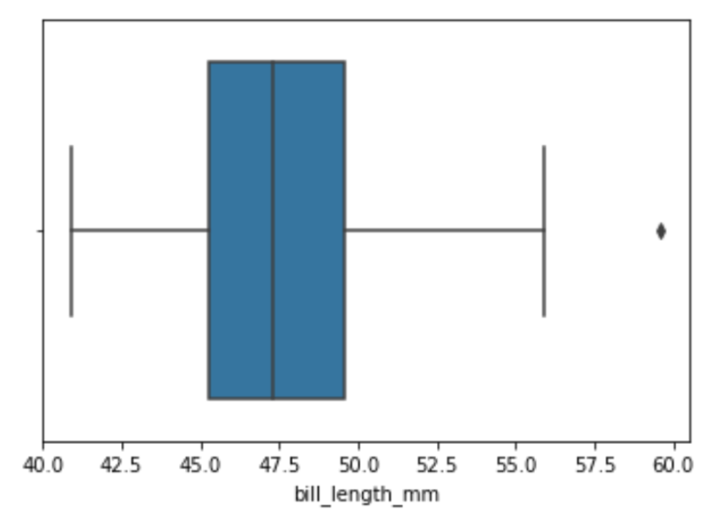
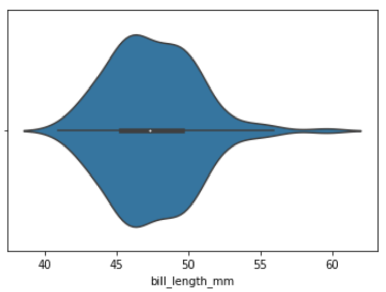

# Center and Variability

## Center
1. Define **mean**, **median**, and **mode**.
   - Mean: The arithmetic mean is found by adding the numbers and dividing the sum by the number of numbers in the list. This is what is most often meant by an average. The median is the middle value in a list ordered from smallest to largest. The mode is the most frequently occurring value on the list. There are other types of means, too. A geometric mean is found by multiplying all values in a list and then taking the root of that product equal to the number of values (e.g., the square root if there are two numbers). The geometric mean is typically used in cases of exponential growth or decline
   - Median: The median is the middle value in a set of numbers
   - Mode: The mode is the most common number in a data set.

2. When people talk about taking an average, which **measure of center** are they usually referring to?

   They generally are referring to the arithmetic mean.

3. What is an **outlier**, and which measure of center does it affect the most?

   An outlier is a value in a data set that is very different from the other values. That is, outliers are values unusually far from the middle. It most effects the mean.

4. if the **median** is greater than the **mean**, what does that tell you about the _skew_ of the distribution?

    The distribution will be skewed left.

5. Give an example of a situation where finding the **mode** of a dataset would be useful.

   Mode is most useful as a measure of central tendency when examining categorical data, such as models of cars or flavors of soda, for which a mathematical average median value based on ordering can not be calculated.

6. Two datasets have the same **mean** of 1.15. Are these two datasets the same? Why or why not?

   Not necessarily. We could have one dataset with one instance of 0 and one instance of 2.3, and another with three instances of 1.15. Both have a mean of 1.15.

## Variability
The **variability** of a dataset is also called its **spread**.

### Range
We will be examining the bill lengths of Gentoo penguins (again). Make sure you have Python code to read and analyze `penguins.csv`

1. What is the **range** of a dataset, and what is the **range** of Gentoo bill lengths?

   The range is the simplest measurement of the difference between values in a data set. To find the range, subtract the lowest value from the greatest value and ignore the others.

2. For this question, let's introduce a new datapoint: a bill length of `80.2`
   1. Does the range change, and if so, what is the new range?
   
      The range changes from 59.6 - 40.9 = 18.7 to the new value of 80.2 - 40.9 = 39.3
   
   2. How will this affect the mean, median, and mode?

      This will increase the mean and median and keep the mode the same.

3. For this question, let's introduce 30 new observations, all with petal length `48.1`
   1. Does the range change, and if so, what is the new range?
   
      The range doesn't change.
   
   2. How will this affect the mean, median, and mode?

      This will increase the mean, median, and mode.

4. Based on your answers above, when do new data points affect the range?

   New datapoints affect the range when they are either less than the previous lower bound or greater than the previous upper bound.

5. What does the range tell us about a dataset, and what _doesn't_ it tell us?

   The range tells us about the dataset's spread.   

### Percentiles and Quartiles
1. What is a **percentile**, and is it a single point or an interval?

   A percentile is a point at which some percent of the data is less than it. For example, the 99th percentile is a point at which 99% of the data is less that where you are.

2. What is a **quartile**?

   Each of four equal groups into which a population can be divided according to the distribution of values of a particular variable.

3. Why is the median sometimes called the **2nd quartile (Q2)**?

   The Median divides data into two equal parts. Quartile divides data into four equal parts. Thus, the value of the median is equal to the value of the second quartile.

4. Examine the following table. What can you tell about the _shape_ of this distribution?
    | Q0 | Q1 | Q2 | Q3 | Q4 |
    |:--:|:--:|:--:|:--:|:--:|
    |0|4|7|9|10|

   The data is skewed left.

### IQR and Basic Visualizations
Shown below is a **box plot** of Gentoo bill lengths.

1. Where do the **whiskers** extend to?

   The whiskers extend to the dataset's extrema.

2. What percentage of the dataset is represented by the **box**?

   The box is the 25th to 75th percentile.

3. What is an **interquartile range (IQR)**?

   The interquartile range (IQR) measures the spread of the middle half of your data. It is the range for the middle 50% of your sample.

4. Any observation that is `1.5*IQR` below Q1 or above Q3 is marked as a _potential_ outlier.
   1. How is this displayed in the box plot? Show the math necessary to determine that datapoint is an outlier.
   
      This is shown by the whiskers in the boxplot.
   
   2. The `1.5IQR` rule can give a false positive; that is, a datapoint that is marked as an outlier even when it isn't one. Describe an example where that happens.

      

Shown below is a **violin plot** for the same data.

1. How do the **box and whiskers** of a violin plot differ from those of a box plot?
2. What information does a violin plot provide that a box plot doesn't?
3. When would we want to use a violin plot over a box plot?

### Deviation
1. What is a datapoint's **deviation** in relation to the dataset mean?
2. What is a dataset's **standard deviation**?
3. What is the standard deviation of Gentoo bill lengths?
4. What is an observation's **z-score**, and how is that related to a dataset's standard deviation?
5. Why might **z-score** be a better measure than deviation?
