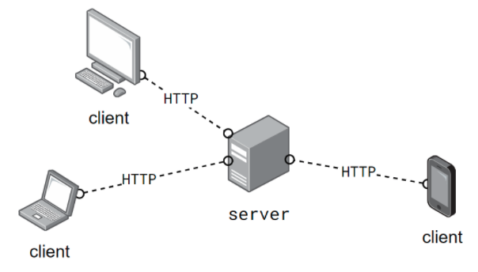
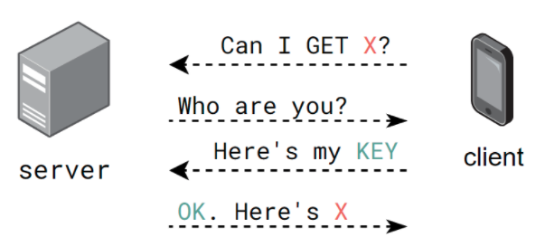

# Intro to APIs
## Background

1. What does **HTTP** stand for, and what does it mean in the context of the _internet_?

    HTTP stands for HyperText (text that can be displayed and formatted on a computer) Transfer Protocol. It is the communications protocol (algorithm) used to connect to Web servers on the Internet. The primary function of HTTP is to establish a connection with the server and send HTML pages back to the user's browser.

2. What is the relationship between a **server** and **clients**?

    A server is a system that stores data. A client is a device that sends a request to access data that is locally stored on the server, such as a laptop connecting to a website.

3. In the context of this diagram and APIs, what is a **URL**?

    If a server is a city, APIs are the seaports and airports that enable outsiders--clients--to access a city without moving there. APIs are the way that people control how others are able to access and use the data on a particular server.
    
    A Uniform Resource Locator (URL), colloquially termed a web address, is a reference to a web resource that specifies its location on a computer network. It tells the server to direct you to a certain piece of data stored at the URL.

4. In the context of this diagram and APIs, what is an **endpoint**?

    Endpoints are the specific points at which clients can access data on the server. URLs are an example of endpoints.

## Server-Client Communication
Let's examine an interaction between a server and a client.

1. How does the server know who the client is?

    The client provides a key that verifies its identity.

2. Why does the server need a `KEY` before sending `X`?

    To prevent giving out data indiscriminately. Examples are paywalls and anti-spam systems such as Cloudflare, which prevents DDoS attacks by limiting the number of simultaneous server connections.

3. The server and client are communicating via HTTP (Hyper _Text_ Transfer Protocol). What format will the requested `X` be sent as?

    We usually will get `X` as a JSON object.

## Data Transfer
### Review
Examine the following Python dictionary.
```py
pokemon = {
    'name': "Scolipede",
    'height': 25,
    'types': [
        {
            'slot': 1,
            'type': "bug"
        },
        {
            'slot': 2,
            'type': "poison
        }
    ]
}
```
1. What does `pokemon["name"]` evaluate to?

    It evaluates to the string "Scolipede" 

3. What does `pokemon["types"]["0"]` evaluate to?

    It returns a dictionary that has `slot : 1` and `type : bug`

5. Write Python code that accesses the `height`.
    
    `pokemon["height"]`
    
6. Write Python code that accesses the `type` in slot 2.

    `pokemon["types"][1]["type"]`


### JSON
1. What does **JSON** stand for? Why is it useful for **REST** APIs?

    JSON stands for "JavaScript Object Notation." It is a syntax in the language javascript for discussing objects. REST stands for "representational state transfer." It leaves some of the implementation up to the creator--it is a set of guidelines that is--and is more common in newer APIs. SOAP is the other type of API, and it is more rigid in its implementation.


Examine the following **Javascript object**.
```js
pokemon = {
    'name': "Scolipede",
    'height': 25,
    'types': [
        {
            'slot': 1,
            'type': "bug"
        },
        {
            'slot': 2,
            'type': "poison
        }
    ]
}
```

2. What does `pokemon['name']` evaluate to?

    "Scolipede"

4. How would you access the `type` in slot 2?

    `pokemon["types"]["2"]`

6. How is a Javascript object different than a Python dictionary?

    They are almost identical.


## Consuming APIs With Python
Let's return to this diagram:  
  
and accompany it with some Python code:
```python
import requests
BASE_URL = "http://www.server.com/"
ENDPOINT = "endpoint"
API_KEY = "abcd1234"

payload = {'key': API_KEY, 'q': "X"}

response = requests.get(BASE_URL+ENDPOINT, params=payload)
if response.ok:
    data = response.json()
else:
    print(reponse.status_code, response.text)
```

1. What is the **requests** module used for?

    It is used to request data through the API.

2. What parameters does the `get` method take?

    The `get` method concatenates a base url (such as "horacemann.org") and an endpoint (such as "/katzlibrary") and also specific parameters

3. What is a **payload** in the context of APIs?

    It is a dictionary that you are sending to the API (usually a dictionary or string) to query the API for data.

4. We can now treat `data` as a Python dictionary. Why is that allowed?

    Because the .json method returns a dictionary.

5. How do we check if the response is OK?

    `if response.ok:
        data = response.json()`

6. What do we do if the response is not OK?

    

7. What is an HTTP **status code**?
    
